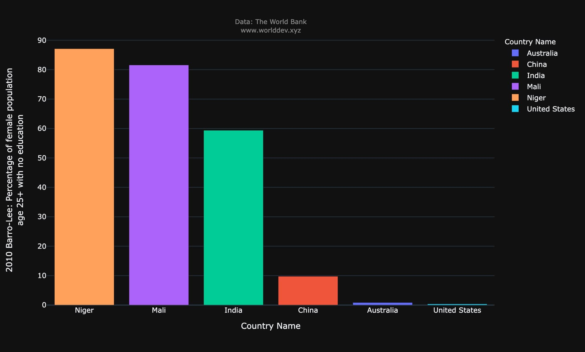

# Project Defense draft

Hi! My name is **Jeevan Sai Sreella**. The data is collected from **The World Development Explorer (WDX)**   [http://www.worlddev.xyz/](http://www.worlddev.xyz/) and World Development Indicators (WDI) is the World Bank’s premier compilation of cross-country historical data on development. The dataset includes more than 1400 socioeconomic indicators of 200 plus countries over 50 plus years. It is rich in information about a country's economy, environment, people, and healthcare (The World Bank, 2021).

I would like to explore 3 topics on  **Education rate, Energy and Mining and Health in Developed, Under Developed and Developing countries**

## Education Rate

- Education rate plays a major role in deciding the development of the nation. Country with high education rate is likely to be in developed countries. I would like to infer if that is true or not based on the indicators of Education rate
- I have selected two countries each from underdeveloped country, developed country and developing countries. They are India, United States, China, Australia, Male and Niger
- Considering minimum education degree completes on or before the age of 25 the percentage of population with 25 + age having no education of different countries are shown below

- Also comparing only female with 25+ age with no education of these countries shown below

-Pie chart showing the percentage of these countries

## Energy and Mining
- Energy and mining is an another sector where imports and exports decides the development of country 
- For this indicator have considered the percentage of merchandise fuel exports and percentage of merchandise fuel imports

- I have also considered the percentage of merchandise ores and metals imports and exports and various graphs are below

## Health Sector

- Health sector is another major sector which decides the countries population, life expectancy.
-  Poor health sector facilities decides the development of the country.
- I have selected the indicators number of people under 5 age deaths and also with respect to male and female
 
 
 

